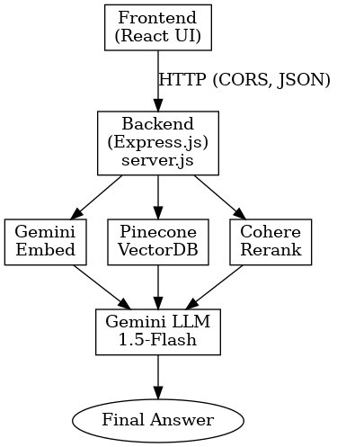

# Mini-RAG (Track B) — README

### Live URLs
- **Website:** https://mini-rag-frontend.onrender.com  
    - (first initialization needs 15 seconds to cold start the backend)
- **Github:** https://github.com/Ascrion/mini-rag.git
- **Resume:** [G-Drive Link](https://drive.google.com/file/d/1z1Cym6jNNaoXG-yy4wx9A50EMKwxGym7/view?usp=sharing)

### Introduction
**mini-rag:** A Gemini + Pinecone + Cohere based Retreival-Augmented Generation pipeline that:
    - Retrieves relevant information from your uploaded documents.
    - Augments the query with those docs.
    - Generates an answer grounded in real sources, with inline citations.
    - Documents are split into ~1,000-token chunks with 15% overlap (~150 tokens)
    - Shows reponse timing, token usage and cost estimates.

### Architecture and Tech Stack
1. Node + Express (Backend)
    - Runs API Server
    - Route Handling (/upsert, /query, /reset, /health)
    - Connects the frontend to external AI services (Gemini, Cohere, Pinecone)
    - Adds rate limiting(30 requests per min per user), CORS, logging and error handling.
2. React (Frontend)
    - User Interface to communicate with backend
    - Allows document text insertion and querying
    - Displays answers + citations.
    - Displays Response Timing, Token Usage and Cost estimates.
3. Gemini (LLM and embedding)
    - Embeddings (embedding-001) converts text chunks into 768-dimensional vectors for semantic search.
    - LLM(gemini-1.5-flash) produces the NLP answer, with inline [1], [2].
4. Pinecone (Vector Database)
    - Stores embeddings (vector representations of your docs).
    - Retrieves the most similar chunks for a given query (semantic search) (topK:8)
5. Cohere (Rerank API)
    - Takes the retrieved chunks and re-orders them by relevance to the query.
    - Ensures the top docs passed to Gemini are the most useful.
    - Improves precision and reduces hallucination risk.

         

### Pinecone Index Config
- Index name: Fetched from PINECONE_INDEX in .env
- Dimension: 768 
- Metric: cosine
- Namespace: "default"
- Deployment: Serverless, AWS us-east-1
- Metadata per vector:
{
  "text": "<chunk text>",
  "docId": "<original doc id>",
  "chunk": <number>,
  "title": "<optional>",
  "url": "<optional>",
  "source": "<optional>",
  "section": "<optional>",
  "position": "<optional>"
}

### Golden Q/A Pairs 
**Test Document Text:** 
    Mini-RAG Project Documentation

    Overview:  
    Mini-RAG is a retrieval-augmented generation system built with Gemini, Pinecone, and Cohere. It retrieves relevant document chunks, reranks them, and generates answers with inline citations.  

    Architecture:  
    1. Backend: Node.js + Express server, connects to AI services and handles routes.  
    2. Frontend: React app for uploading text, querying, and displaying answers.  
    3. Embeddings: Gemini embedding-001 (768-dim).  
    4. Vector Database: Pinecone, cosine similarity search, serverless deployment in AWS us-east-1.  
    5. Reranker: Cohere Rerank API, reorders retrieved chunks by relevance.  
    6. LLM: Gemini-1.5-Flash for generating answers with citations.  

    Chunking Strategy:  
    Documents are split into ~1,000-token chunks with ~15% overlap. Metadata includes text, docId, chunk, title, section, and position for traceability.  

    Hosting:  
    The project is deployed on Render (free tier). Cold starts may take ~15 seconds.  

    Future Improvements:  
    - Migrate to Cohere production API.  
    - Separate databases per user namespace.  
    - Upgrade hosting to ensure 24/7 uptime.  

**Questions:**

1. Which vector database is used in Mini-RAG?
    - Answer: Mini-RAG uses Pinecone as its vector database [1].
2. What model is used for embeddings?
    - The Mini-RAG project uses Gemini embedding-001 (768-dim) for embeddings [1].
3. What strategy is used for chunking documents?
    - Documents are split into approximately 1,000-token chunks with about 15% overlap [1].
4. Explain data pipeline flow in detail.
    - The Mini-RAG system's data pipeline begins with document chunking into approximately 1,000-token segments with roughly 15% overlap [1]. Metadata such as text, docId, chunk, title, section, and position are included for traceability [1]. A Node.js and Express server backend connects to AI services and manages routes [1]. Gemini embedding-001 generates 768-dimensional embeddings [1], which are stored in a Pinecone vector database deployed serverlessly in AWS us-east-1 [1]. Pinecone performs cosine similarity search to retrieve relevant chunks [1], which are then reranked by the Cohere Rerank API [1]. Finally, the Gemini-1.5-Flash LLM generates answers with inline citations based on the reranked chunks [1]. A React frontend handles text uploads, querying, and answer display [1].
5. How long can cold starts take on Render hosting?
    - Cold starts on Render hosting may take approximately 15 seconds. [1]

| Question                                         | Time (ms) | I/P Tokens | O/P Tokens | Cost   | Accuracy & Notes|
| ------------------------------------------------ | --------- | ---------- | ---------- | ------ | --------------- |
| Which vector database is used in Mini-RAG?       | 2228      | 490        | 71         | ₹0.035 |Correct answer   |
| What model is used for embeddings?               | 2547      | 487        | 91         | ₹0.035 |Correct answer   |
| What strategy is used for chunking documents?    | 2062      | 489        | 89         | ₹0.035 |Correct answer   |
| Explain data pipeline flow in detail.            | 5167      | 486        | 568        | ₹0.097 |Correct answer   |
| How long can cold starts take on Render hosting? | 1916      | 491        | 69         | ₹0.026 |Correct answer   |
**Result:**
- Accuracy: 100% .
- Avg Latency: ~2.8s
- Avg Tokens: ~489 input, ~178 output.
- Avg Cost: ~₹0.046 per query.

### Setup Process

1. Clone the repository
    ```
    git clone https://github.com/Ascrion/mini-rag.git
    cd mini-rag
    ```

2. Backend Setup 
    - Enter your API keys to the .env file
    - Runs at http://localhost:4000 by default
    ```
    npm install
    cp .env.example .env 
    node server.js
    ```
3. Frontend setup 
    - Runs at http://localhost:3000 by default
    ```
    cd frontend
    npm install    
    npm start    
    ```
4. Usage 
    - Open frontend in your browser
    - Insert document text in Add Documents section
    - Enter a question in the query box
    - Wait for the server response 
    - See the answer with inline citations [1], [2] in answer section.

### Remarks:
    - This project implements a basic production ready RAG Pipeline.
    - Documents are split into 1,000-token chunks to keep embedding costs low while maintaining enough context window
    - 150 token overlap reduces risk of losing information at chunk boundaries. 
    - Due to the small influx of requests, no rate-limits were breached
    - Future Improvements:
        - Move to Cohere Production API from trial API as it is the most rate-limited section of the pipleline.
        - Separate Databases for stoing namespaces per user.
        - Move to paid render plans / serverless functions to ensure 24*7 uptime
        - Enter documents such as PDFs inplace of just plain text.

### Attribution:
All external tools and APIs were used via their official SDKs and documentation.
- https://ai.google.dev
- https://www.pinecone.io
- https://cohere.com